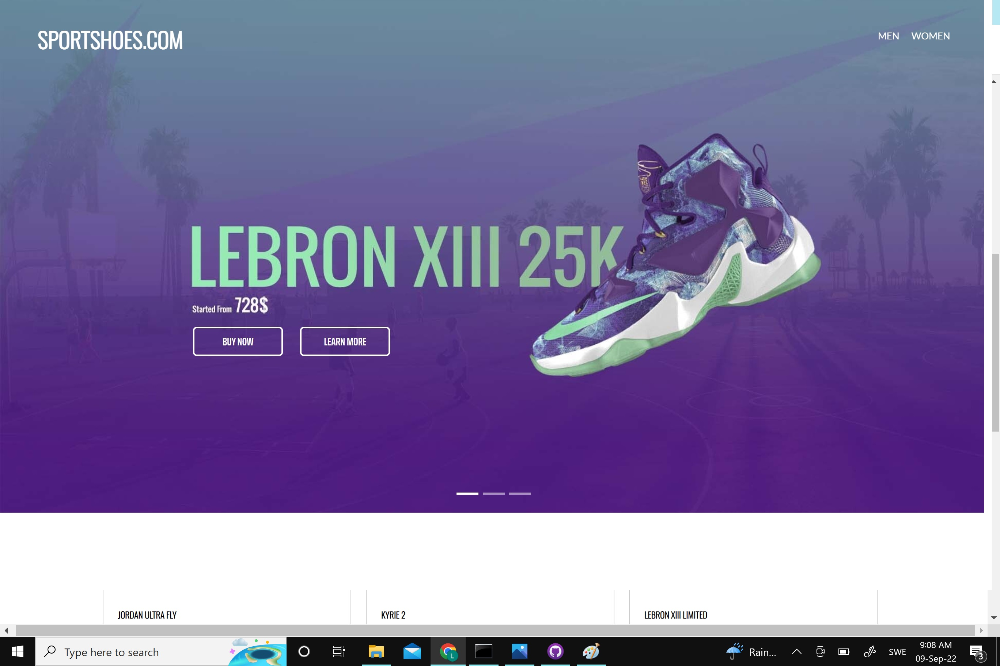

# HLDesignTest

Webshop for shoes that displays the products via an external API.

## Usage Example

   

## Used technologies

- For creating the app: 
   - NodeJs version 16.14.0
   - Bootstrap v.5
   - Html & Css
   - npm version 8.19.1
   - NodeJs version 16.14.0
   - Visual Studio Code version 1.71.0
   - Used API : https://webshop.wm3.se/api/v1/shop/products.json?media_file=true

## How to run the program

- Download the project
- Make sure to have the latest versions of node and npm by running node -v and npm -v otherwise download them
- Go to the terminal on your computer then to your downloaded project and run npm install
- Run node app.js
- Go to https://localhost:3000
- Enjoy !

## Project done by Lina Abu Hijleh
 
